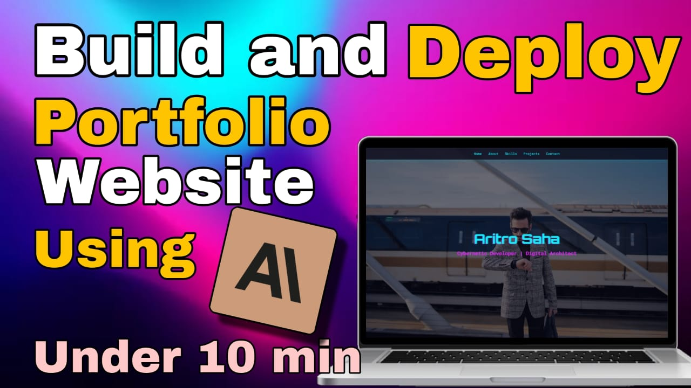

# Portfolio Website Using AI in 10min

This is the repository for your reference for the youtube video where I teach you how you can build you portfolio website in 10min using AI.

## Click to Watch Youtube Video
[](https://youtu.be/eiCjbOQL8fE "Click to Play Video Demonstration")

## Live Link

[Click Here For Live Link](https://halcyon-past.github.io/Portfolio-Using-AI-VeriPyed/)

## Setup

### Prerequisites

- : Download Visual Studio Code from [here](https://code.visualstudio.com/).
- : If you want to host your website in github you need to have a github account.

### Instructions

1. **Download The Repository**:

2. **Copy the Contents from 'Get Started With' Folder to the root directory**:

3. **Delete All The Other Files Which are present**
   The Final List of Files Would be (all from Get Started With):
   - index.html 
   - me.jpeg
   - project1.jpg 
   - project2.jpg
   - project3.jpg

3. **Modify The Images and use your image name and update the image name in the HTML code**
   - For Your own image (Make sure it is horizontal)
      - Modify This Code snippet:
         ```css
         .hero {
            background-image: url('me.jpeg'); /* Add Your Image Here */
            background-size: cover;
            background-position: center;
            color: #fff;
            text-align: center;
            height: 100vh;
            display: flex;
            flex-direction: column;
            justify-content: center;
            align-items: center;
            margin-top: 60px;
        }
         ```
      - To
         ```css
         .hero {
            background-image: url('<your_image_name>'); /* Add Your Image Here */
            background-size: cover;
            background-position: center;
            color: #fff;
            text-align: center;
            height: 100vh;
            display: flex;
            flex-direction: column;
            justify-content: center;
            align-items: center;
            margin-top: 60px;
        }
         ```
   - For Each Project
      - Modify This Code snippet:
         ```html
         <div class="project-card">
            
            <h3>Project 1</h3>
            <p>A web app built with React and Node.js.</p>
            <a href="#">View Project</a>
         </div>
         ```
      - To
         ```html
         <div class="project-card">
            " alt="Project 1">
            <h3>Project 1</h3>
            <p>A web app built with React and Node.js.</p>
            <a href="#">View Project</a>
         </div>
         ```

4. **Install Live Server in VSCODE**:

5. **Update code using Claude with the given prompt**:
   ```
   Design this Portfolio use gsap for scroll animations in all sections The design should be a blue pink neon cyberpunk theme design there should be glitch effects and also use a fonts library to add icons to the website make the education and work section in a timeline design from start to finish make sure to keep the background image in the hero section and make sure the items are centered in their respective divs make sure to make th project cards using the images given and the navbar should be responsive with a hamburger menu
   ```

6. **Deploy in Github Pages**:

Follow the Youtube Video to Understand in Full Details how to perform each step

## Contact

Made with ❤️ by Aritro Saha  
[](https://github.com/halcyon-past)      [](https://www.linkedin.com/in/aritro-saha/)    [](https://aritro.tech/)    [](https://www.youtube.com/@veripyed)